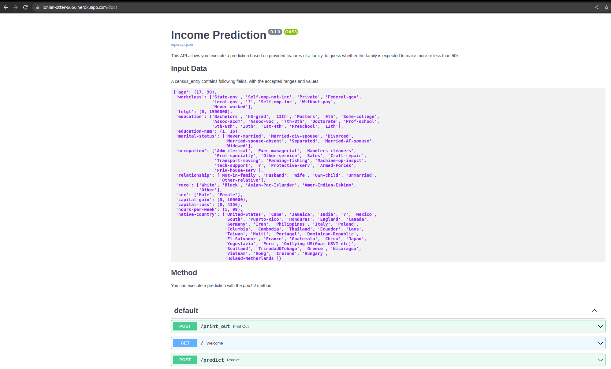

## LOCAL DEPLOYMENT

### SET UP ENVIRONMENT
To execute the code locally, set up a conda environment with the following command

```
conda create -n [envname] "python=3.8" 
conda activate [envname]
python -m pip install -r requirements_local.txt
```

### MANAGING DATA

The data can be found in the directory `data`. It is managed with DVC by means of `census.csv.dvc`.
It is retrieved from a remote repository, `s3://ud-mlops-3/census`
It can be retrieved with `dvc pull`

Using this data we can create a model able to predict whether someone earns more or less than 50K based on their census data.
It contains a version of the census data, which has been managed with `DVC` and cleaned up to get better results
The original data is in the file `orig_census.csv.dcv`

### DATA ANALYSIS

The data analysis can be found in `notebooks`.
Analysis of data can be started in the notebook [notebooks/Analyze Census_Data.ipynb](notebooks/Analyze_Census_Data.ipynb) with the command

```
jupyter notebook --NotebookApp.iopub_msg_rate_limit=1e10 --NotebookApp.rate_limit_window=30.0 "notebooks/Analyze_Census_Data.ipynb"
```

### MODEL CREATION

An AI Model can be created using the `train_model.py` script. It can be called with following, optional parameters

```
python train_model.py --model_dir_name <model directory destination> --data_file_name <the data file name to  use>
```


or you can use the jupyter Notebook  [notebooks/Train_Model.ipynb](notebooks/Train_Model.ipynb)

```
jupyter notebook --NotebookApp.iopub_msg_rate_limit=1e10 --NotebookApp.rate_limit_window=30.0 "notebooks/Train_Model.ipynb"
```

By default the model is saved under `model\latest`

### EVALUATE MODEL

To evaluate your model, execute

```
python evaluate_model.py --model_dir_name <model directory destination> --data_file_name <the data file name to  use>
```

An evaluation of the model and how it behaves can be found in [notebooks/Analyse Model performance.ipynb](notebooks/Analyse_Model_performance.ipynb)

```
jupyter notebook --NotebookApp.iopub_msg_rate_limit=1e10 --NotebookApp.rate_limit_window=30.0 "notebooks\Analyse Model performance.ipynb"
```

### LOCAL API


The API used to call the model and retrieve a result can be found in `api/main.py`.
A web server publishing the model that can be used to return predictions can be started from a command line with `uvicorn api.main:app`,  
which will start the application on `http://127.0.0.1:8000`.

Under `http://127.0.0.1:8000/docs`, you will be able to submit a request


Then with the test `TEST_LOCAL_API=1 python -m pytest test/test_local_census_api.py` it can be verified that a model is running and giving prediction results

You can also use the notebook [notebooks/Start API.ipynb](notebooks/Start_API.ipynb) to test the local call to the API.

### TESTING

The tests are located in the `test` directory and can be executed with `PYTHONPATH=$(pwd) pytest`.


## DEPLOYING REMOTELY

The project is deployed on github: https://github.com/diegoami/census_heroku

To ensure CI/CD and deployment on Heroku, three workflows have been set up.

* _test_ executes tests, but does not deploy
* _test_and_deploy_ executes retrieves data, creates a model and deploys it on heroku
* _deploy_ deploys the model to heroku. The model deployed is the one in the directory `model/latest`




The two scripts deploy to a different applications: ```ionian-otter-6666``` and ```sanguinetto-news-1357```.
The API can be accessed from `http://http://ionian-otter-6666.herokuapp.com/docs` and  `http://sanguinetto-news-1357.herokuapp.com/docs` respectively.

## REMOTE TEST

After deployment, a test can be executed to verify that the Remote API works correctly

```
TEST_REMOTE_API=1 HOST=ionian-otter-6666.herokuapp.com python -m pytest test/test_remote_census_api.py
TEST_REMOTE_API=1 HOST=sanguinetto-news-1357.herokuapp.com python -m pytest test/test_remote_census_api.py
```


You can also use the notebook [notebooks/Start Remote API.ipynb](notebooks/Start_Remote_API.ipynb) to test the remote call to the API.

You can also execute the script `sample_requests.py`


